# ✨ VibeBuilder

**Build your dream web app in seconds with AI.**

VibeBuilder V2 is an open-source, agentic AI web builder that orchestrates a team of specialized AI agents to research, plan, code, test, and debug modern web applications from a single text prompt. Powered by **Google Gemini 2.5 Flash**.


_(Note: Replace this placeholder with a real screenshot of your running application)_

## 🚀 Features

- **Multi-Agent Architecture**: A coordinated team of 5 AI agents (Researcher, Architect, Coder, Tester, Debugger) working in unison.
- **Gemini 2.5 Flash Integration**: Blazing fast inference for real-time application building.
- **Web Researcher**: Grounded in real-time data using Google Search to find current design trends and requirements.
- **Live Preview**: Instantly render and interact with your generated app in a secure sandbox.
- **Streaming UI**: Watch the AI "think" and build in real-time with a typewriter effect interaction.
- **Refinement Loop**: Chat with the AI to tweak designs, fix bugs, or add new features instantly.
- **Professional UI**: A "Lovable" / "Replit" inspired clean, dark/light mode interface.

## 🏗️ Architecture

The system uses a **Flask** backend to manage the agent orchestration and a vanilla **HTML/JS** frontend for a fast, build-free developer experience.

```mermaid
graph TD
    User[User Prompt] --> Orchestrator
    Orchestrator --> Researcher[🔍 Researcher Agent]
    Researcher -->|Trends & UX| Architect[📐 Architect Agent]
    Architect -->|Blueprint| Coder[💻 Coder Agent]
    Coder -->|Raw HTML/CSS/JS| Tester[🧪 Tester Agent]
    Tester -->|Feedback| Debugger[🔧 Debugger Agent]
    Debugger -->|Polished Code| Orchestrator
    Orchestrator -->|Live Stream| Frontend[✨ VibeBuilder UI]
```



## 🛠️ Installation

1.  **Clone the repository**

    ```bash
    git clone https://github.com/yourusername/vibe-builder-v2.git
    cd vibe-builder-v2
    ```

2.  **Create a virtual environment**

    ```bash
    python -m venv venv

    # Windows
    venv\Scripts\activate

    # Mac/Linux
    source venv/bin/activate
    ```

3.  **Install dependencies**

    ```bash
    pip install -r requirements.txt
    ```

4.  **Configure Environment**
    Create a `.env` file in the root directory and add your Google API Key:
    ```ini
    GOOGLE_API_KEY=your_gemini_api_key_here
    ```

## 🏃 Usage

1.  **Start the server**

    ```bash
    python src/server.py
    ```

2.  **Open the application**
    Navigate to `http://localhost:5000` in your browser.

3.  **Build an App**
    - Type a prompt like: _"A pomodoro timer with a cyberpunk aesthetic and task list"_
    - Press **Ctrl + Enter** or click **Build App**.
    - Watch the agents research, plan, and build your app in real-time!

## 🤝 Contributing

Contributions are welcome! Please feel free to submit a Pull Request.

## 📄 License

This project is licensed under the MIT License - see the [LICENSE](LICENSE) file for details.

---

**Built for the Gemini 3 Hackathon 2026**
